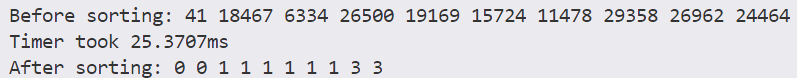

# TimerCnt

TimerCnt可以用于对程序运行进行计时，这个方法我是在Cherno的视频学来的，附带了相应的单元测试TimerCb_UnitTest.cpp。

## 设计原理

使用了C++的RAII思想（Resource Acquisition is Initialization），定时器的构造函数里使用now得到初始化的时刻start，定时器的析构函数里使用now得到初始化的时刻end，两者作差最后得到时间差即程序的消耗的时间。这里我是直接打印出来了，思路还是比较清晰的：

```cpp
TimerCnt::TimerCnt()
{
    start = std::chrono::high_resolution_clock::now();
}

TimerCnt::~TimerCnt()
{
    end = std::chrono::high_resolution_clock::now();
    duration = end - start;
    float ms = duration.count() * 1000.0f;
    std::cout << "Timer took " << ms << "ms" << std::endl;
}
```

也可以使用日志的方式进行打印。在我的另一个Log文件夹里这部分会有说明。具体使用的时候，我们可以把我们要关键测试的代码用大括号给括起来，并在大括号里的开头我们初始化TimerCnt，出了大括号的作用域以后TimerCnt就会调用析构函数，这样我们就获得了我们的程序的运行时间。

## 快速上手

在测试样例里我写了一个快速排序进行时间的测试，我定义了随机的100000个元素，然后对它进行排序，在这里，我们会打印排序前和排序后数组前面的10个数字：

```cpp
void quickSort(std::vector<int> &v, int l, int r)
{
    if (l >= r)
        return;
    int pivot = v[l];
    int i = l, j = r;
    while (i < j)
    {
        while (i < j && v[j] >= pivot)
            --j;
        v[i] = v[j];
        while (i < j && v[i] <= pivot)
            ++i;
        v[j] = v[i];
    }
    v[i] = pivot;
    quickSort(v, l, i - 1);
    quickSort(v, i + 1, r);
}

// 打印数组前10个元素
void printArray(const std::vector<int> &arr)
{
    for (size_t i = 0; i < std::min(arr.size(), size_t(10)); ++i)
    {
        std::cout << arr[i] << " ";
    }
    std::cout << std::endl;
}

int main()
{
    std::vector<int> arr;
    arr.resize(100000, 0);
    for (size_t i = 0; i < 100000; ++i)
        arr[i] = rand() % 100000;

    std::cout << "Before sorting: ";
    printArray(arr);
    {
        TimerCnt timerCnt;
        quickSort(arr, 0, arr.size() - 1);
    }

    std::cout << "After sorting: ";
    printArray(arr);
}
```
最后测试的结果：



