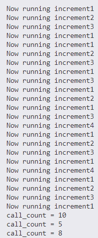

# TimerScheduler

TimerScheduler是一个基于定时器的调度器，内部基于小顶堆实现，允许定期或一次性运行函数，可以支持插入多个需要定时的函数。主要是参考了知乎的帖子[https://zhuanlan.zhihu.com/p/593175204](https://zhuanlan.zhihu.com/p/593175204)，附带了相应的单元测试TimerScheduler_UnitTest.cpp。设计也挺精巧的，这里也展开说一说。

## 设计原理


**主要组件**
+ RepeatFunc 结构体：包含一个回调函数 cb 和计算下次运行时间的函数 nextRunTimeFunc。提供方法来设置和重置下次运行时间。允许通过 cancel() 方法取消函数。
+ FunctionScheduler 类：管理多个 RepeatFunc 实例。使用一个线程来按计划运行函数。提供添加、取消和启动/停止调度器的方法。

**关键方法**
+ addFunction 和 addFunctionOnce：将函数添加到调度器中，分别用于定期和一次性执行。addFunction是要定时执行的函数，函数参数有一项interval设置定时器的周期，而addFunctionOnce则没有这个参数，这两个函数最后都会调用addFunctionToHeapChecked函数，关键在于这一句：

```cpp
std::unique_ptr<RepeatFunc> func = std::make_unique<RepeatFunc>(std::move(cb), std::forward<IntervalFunc>(fn), nameID, intervalDescr, startDelay, runOnce);
```

这里使用移动语义和完美转发设置RepeatFunc类型的独占指针func，后续把它插入到堆里，对于定时执行的函数，runOnce传入的是false，对于非定时执行的函数，runOnce传入的是true（这个runOnce可以用于后续判断函数是否从堆中弹出还要重新放入堆），fn是一个ConstIntervalFunctor的结构体，要求传入的interval是大于等于0的（大于0是定时执行的函数，等于0认为是执行一次的函数），然后通过仿函数的方式可以直接从结构体获取对应的interval，方便RepeatFunc后续使用interval获得下一次函数出触发的时间，并重新调整堆。
+ start 和 shutdown：控制调度器的启动和停止。在初始启动时重置所有函数的下次运行时间（使用startDelay参数），另外在start以后running会被设置为true，如果在start以后重新添加函数，也会堆函数的下次运行时间进行计算，然后再放入堆中。
+ run 和 runOneFunction：run 方法在循环中检查并运行到期的函数，从堆中取出合法的函数，然后调用runOneFunction 实际执行函数，并根据runOnce决定是否将函数重新置于堆中进行下一次的定时运行。同时根据steady模式决定下一次定时运行计算的方式：
```cpp
if (steady_)
{
    // This allows scheduler to catch up
    func->setNextRunTimeSteady();
}
else
{
    // Note that we set nextRunTime based on the current time where we started
    // the function call, rather than the time when the function finishes.
    // This ensures that we call the function once every time interval, as
    // opposed to waiting time interval seconds between calls.  (These can be
    // different if the function takes a significant amount of time to run.)
    func->setNextRunTimeStrict(now);
}
```

setNextRunTimeSteady函数使用程序原来的nextRunTime来计算下一次程序执行的时间，这样每个nextRunTime的间隔时间都是interval：

```cpp
void setNextRunTimeSteady()
{
    nextRunTime = nextRunTimeFunc(nextRunTime);
}
```

setNextRunTimeStrict函数使用程序当前的时间curTime来计算下一次程序执行的时间，这样每个nextRunTime都是严格以curTime为基准且和curTime的间隔是interval：

```cpp
void setNextRunTimeStrict(std::chrono::steady_clock::time_point curTime)
{
    nextRunTime = nextRunTimeFunc(curTime);
}
```

**线程和同步**

+ 使用互斥锁和条件变量进行线程同步。
+ 调度器在运行时维护一个小顶堆，以便快速找到下一个需要运行的函数。
+ 确保在执行回调时释放锁，以避免阻塞其他操作。
```cpp
lock.unlock();

try
{
    std::cout << "Now running " << func->name << std::endl;
    func->cb();
}
catch (const std::exception &ex)
{
    std::cout << "Error running the scheduled function <" << func->name << ">: " << ex.what() << std::endl;
}

lock.lock();
```

**其他特性**

+ 取消功能：可以通过名称取消正在计划或正在运行的函数。提供立即取消cancelFunction和等待取消完成cancelFunctionAndWait的方法。这里要强调的是如果函数当前正在被线程运行怎么取消函数不会早场冲突，立即取消即将cancellingCurrentFunction_设置为true，不阻塞地往下执行；而cancellingCurrentFunction_等待取消设置为true，并且将当前的函数句柄设为nullptr，使用条件变量wait工作线程执行完函数以后，根据当前函数句柄为nullptr将cancellingCurrentFunction_设置为false从而让条件变量跳出等待。

cancelFunction的写法：

```cpp
if (currentFunction_ && currentFunction_->name == nameID)
{
    functionsMap_.erase(currentFunction_->name);
    // This function is currently being run. Clear currentFunction_
    // The running thread will see this and won't reschedule the function.
    currentFunction_ = nullptr;
    cancellingCurrentFunction_ = true;
    return true;
}
```

cancelFunctionAndWait的写法：

```cpp
if (currentFunction_ && currentFunction_->name == nameID)
{
    functionsMap_.erase(currentFunction_->name);
    // This function is currently being run. Clear currentFunction_
    // The running thread will see this and won't reschedule the function.
    currentFunction_ = nullptr;
    cancellingCurrentFunction_ = true;
    runningCondvar_.wait(lock, [this]()
                            { return !cancellingCurrentFunction_; });
    return true;
}
```

## 快速上手

在测试样例里我定义了一个Counter类，然后以lambda表达式的方式为定时器添加函数，定时器里有一个vector构成的堆，可以在定时器start之前和之后插入函数，并且函数可以指定startDelay来规定函数首次执行的延迟时间。


```cpp
class Counter
{
public:
    void increment()
    {
        std::lock_guard<std::mutex> lock(mutex_);
        ++count_;
    }

    int count() const
    {
        std::lock_guard<std::mutex> lock(mutex_);
        return count_;
    }

private:
    mutable std::mutex mutex_;
    int count_ = 0;
};


int main()
{
    TimerScheduler scheduler;
    Counter counter1, counter2, counter3;

    scheduler.addFunction([&]
                          { counter1.increment(); }, milliseconds(100), "increment1", milliseconds(50));
    scheduler.addFunction([&]
                          { counter2.increment(); }, milliseconds(200), "increment2", milliseconds(100));
    scheduler.addFunction([&]
                          { counter3.increment(); }, milliseconds(150), "increment3", milliseconds(150));

    scheduler.start();
    std::this_thread::sleep_for(milliseconds(500)); // 等待足够时间让函数运行几次
    scheduler.addFunction([&]
                          { counter3.increment(); }, milliseconds(200), "increment4", milliseconds(150));
    std::this_thread::sleep_for(milliseconds(500)); // 等待足够时间让函数运行几次

    scheduler.shutdown();
    printf("call_count = %d\n", counter1.count());
    printf("call_count = %d\n", counter2.count());
    printf("call_count = %d\n", counter3.count());
}
```

执行结果：



